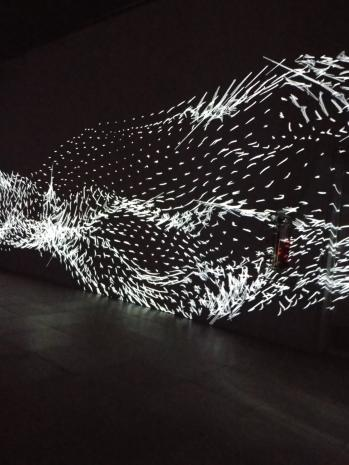
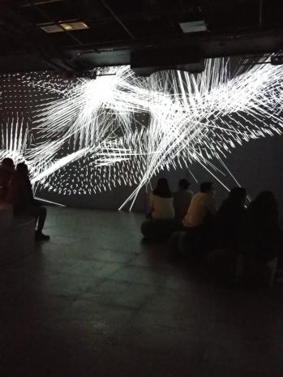
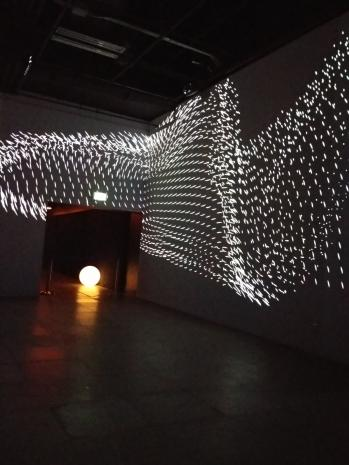

Ceci est la fiche technique pour la présentation de Oasis Immersion Core.

## Titre de l'oeuvre ou de la réalisation
Core

.jpg)
Source: https://oasis.im/en/now-showing/

## Nom de l'artiste ou de la firme 
Adrien M et Claire B

## Année de réalisation
2020

## Nom de l'exposition ou de l'évènement
Oasis Immersion

## Lieu de mise en exposition
301 rue Saint-Antoine Ouest, Montréal, Québec, H2Z 1H5

## Date de votre visite
26 février 2022

## Description de l'oeuvre ou du dispositif multimedia
La pièce contemplative Core est un ballet synesthésique de lumières et de sons qui donne corps au vide, « une puissance hypnotique et symphonique, comme une force qui circule, irrigue, agit à distance. »

## Explications sur la mise en espace de l'oeuvre ou du dipositif
Il y a une pièce avec des murs sur lesquels on projette l'oeuvre. Plusieurs projecteurs et haut-parleurs sont disposés dans la salle pour offrir une expérience immersive.

## Liste des composantes et techniques de l'oeuvre ou du dispositif
-Projecteurs

-Haut parleur

.jpg)

## Liste des éléments nécessaires pour la mise en exposition
-Herse

-Ordinateur

# Expérience vécue :

## Description de votre expérience de l'oeuvre ou du dispositif, de l'interactivité, des gestes à poser, etc.
L'oeuvre consistait à regarder et essayer de comprendre le message étant donné que c'est une oeuvre contemplative. Le mouvement et le rythme de la projection des billes blanches m'ont fait penser au début de la vie. Étant donné que j'aime la science, j'ai tout de suite pensé que les billes blanches représentaient des atomes et qu'en s'unissant ils créent la matière. La matière remplie le vide de l'univers. Aussi, elle a une force avec laquelle elle peut créer du mouvement comme des battements de coeur ou encore une vague.

## Ce qui vous a plu, vous a donné des idées et justifications
J’ai bien aimé le mouvement des particules blanches qui était très fluide et synchronisé. Malheureusement, je trouve ce concept mal exploité. L'idée de créer du mouvement grâce à des particules était bonne, mais les artistes auraient pu aller encore plus loin. Ils auraient pu créer des images ou des formes avec les billes blanches.

## Aspect que vous ne souhaiteriez pas retenir pour vos propres créations ou que vous feriez autrement et justifications
Je pense que j'aurais essayé de mettre plus de couleurs et de mouvements différents aux particules. J'aurais créer des formes particulières pour les transformer en  images.
-
https://www.am-cb.net/projets/core
-
https://youtube.com/watch?v=BLCaN9VAtac&feature=share
-
-
-
-
-

