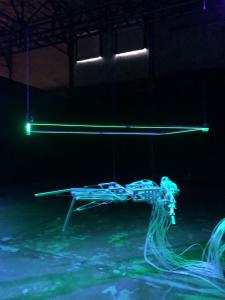
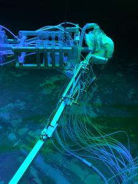
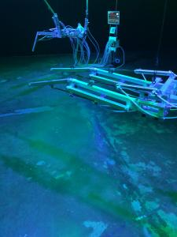
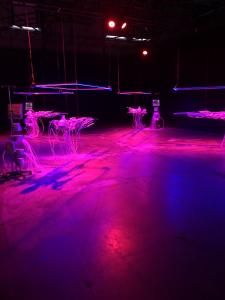
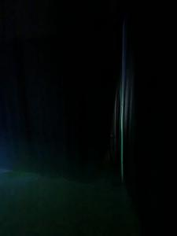
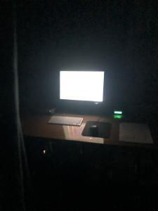
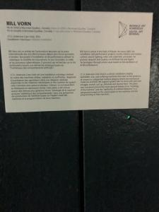
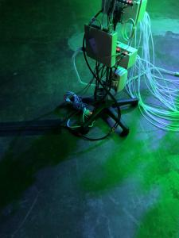

# Portfolio_Tommy_Lemay_01

## Titre de l'oeuvre ou de la réalistion
Intensive Care Unit
## Nom de l'artiste ou de la firme 
Bill Vorn
## Année de réalisation
2021
## Nom de l'exposition ou de l'évènement
Bian
## Lieu de mise en exposition
Biennale Art Numérique
## Date de votre visite
9 février 2022
## Description de l'oeuvre ou du dispositif multimedia
ICU est une installation robotique mettant en scène des machines alités, maladives et souffrantes, réagissant à la présence des spectateurs dans une allégorie médicale disjoncté où les créatures mécaniques et leurs systèmes de support s’animent avec peine et douleur, s’étirent et se recroqueville, se disloquent et reprennent leur forme.
## Explications sur la mise en espace de l'oeuvre ou du dipositif
Il y a plusieurs robots mécaniques suspendus par des câble , au dessus d’eux il y a un carré avec des leds, tout ça éclairé par des projecteurs suspendus accrochés à la herse d’éclairage , des hauts parleurs sont disposés sur la herse d’éclairage dans les quatre coins de la pièce.
## Liste des composantes et techniques de l'oeuvre ou du dispositif
Projecteurs
Haut parleur
Carré en led 
Ordinateur
## Liste des éléments nécessaires pour la mise en exposition
Câbles de soutien 
Crochets 
Rideau 
Herse d’éclairage 

Pour faire fonctionner cette œuvre, je dois faire des mouvements à côté du robot

J’ai bien aimé l’idée des mouvements hasardeux des robots, aussi l’éclairage avec les leds qui donne un côté futuriste.

Je pense qu’il aurait été mieux de cacher des fils, car selon moi il y a beaucoup trop de fils. Je trouve que l’œuvre est gâché par ces trop nombreux fils.

